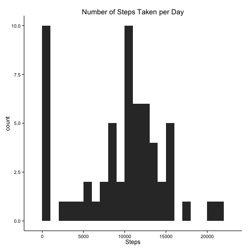
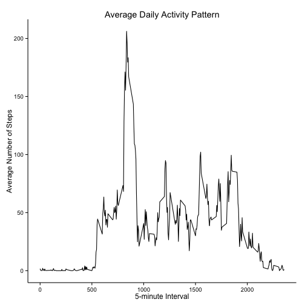
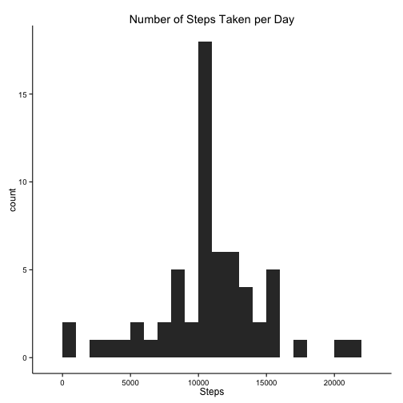
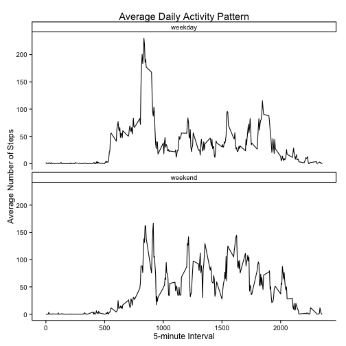

# Reproducible Research: Peer Assessment 1


## Loading and preprocessing the data

```r
library(ggplot2)
library(dplyr)
df <- read.csv(con <- unz("activity.zip", "activity.csv"))
df$date <- as.POSIXct (df$date, tz="", format="%Y-%m-%d")

dayTable <- df %.%
  group_by(date) %.%
  summarize (total = sum(steps, na.rm=T))

intervalTable <- df %.%
  group_by(interval) %.%
  summarize(mean = mean(steps, na.rm=T))
```

## What is mean total number of steps taken per day?

```r
ggplot(dayTable, aes(x=total)) +
  geom_histogram(binwidth=1000) +
  ggtitle("Number of Steps Taken per Day") +
  xlab("Steps") +
  theme_classic()
```

 

### Mean and median number of steps taken per day

```r
origMean <- mean(dayTable$total, na.rm=TRUE)
origMedian <- median(dayTable$total, na.rm=TRUE)
```
The average number of steps taken per day, excluding missing values, is 9354 and the median number of steps is 1.0395 &times; 10<sup>4</sup>.


## What is the average daily activity pattern?

```r
ggplot(intervalTable, aes(x=interval, y=mean)) +
  geom_path() +
  ggtitle("Average Daily Activity Pattern") +
  ylab("Average Number of Steps") +
  xlab("5-minute Interval") +
  theme_classic()
```

 

### Interval with Max Average Number of Steps

```r
intervalMax <- 
    intervalTable$interval[intervalTable$mean==max(intervalTable$mean)]
```
The 5-minute interval with the maximum number of steps on average is 835.


## Imputing missing values

### Number of Rows with Missing Values

There are 2304 5-minute intervals with missing data. 


Missing data was filled in by imputing the computed average for the associated 5-minute interval.

### Histograms with Missing Values Filled In

```r
filledDayTable <- filledDF %.%
  group_by(date) %.%
  summarize(total = sum(steps, na.rm=T))

ggplot(filledDayTable, aes(x=total)) +
  geom_histogram(binwidth=1000) +
  ggtitle("Number of Steps Taken per Day") +
  xlab("Steps") +
  theme_classic()
```

 

### Mean and Median with Missing Values Filled In

```r
filledMean <- mean(filledDayTable$total, na.rm=TRUE)
filledMedian <- median(filledDayTable$total, na.rm=TRUE)
```
The average number of steps taken per day, excluding missing values, is 1.0766 &times; 10<sup>4</sup> and the median number of steps is 1.0766 &times; 10<sup>4</sup>.  The mean with missing numbers imputed is 1412 greater than the original and the median with missing numbers imputed is 371 greater.  

## Are there differences in activity patterns between weekdays and weekends?

```r
filledDF$day <- weekdays(filledDF$date)
weekend <- c("Saturday", "Sunday")
filledDF$weekday[filledDF$day %in% weekend] <- "weekend"
filledDF$weekday[!(filledDF$day %in% weekend)] <- "weekday"

filledIntervalTable <- filledDF %.%
  group_by(interval, weekday) %.%
  summarize(mean = mean(steps, na.rm=T))

ggplot(filledIntervalTable, aes(x=interval, y=mean)) +
  geom_path() +
  facet_wrap(~weekday, ncol=1) +
  ggtitle("Average Daily Activity Pattern") +
  ylab("Average Number of Steps") +
  xlab("5-minute Interval") +
  theme_classic()
```

 

